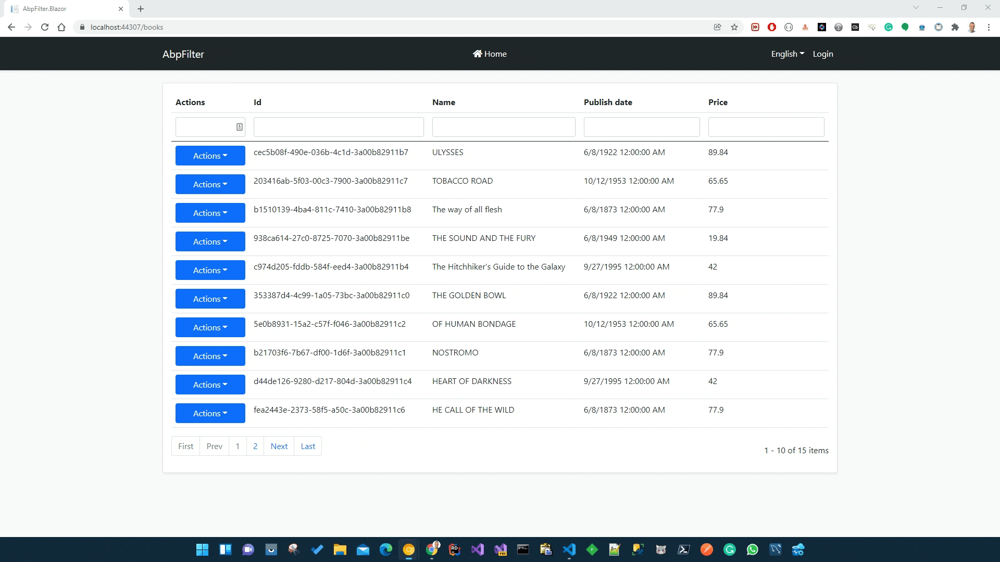

## How to filter a standard paged list in the ABP Framework

## Introduction

In this article, I will show you how to filter a paged list (**Blazorise DataGrid component**) in an ABP Framework application with a Blazor user interface.

The sample application has been developed with **Blazor** as UI framework and **SQL Server** as database provider.

## Source Code

The source code of the completed application is [available on GitHub](https://github.com/bartvanhoey/AbpFilter).

## Requirements

The following tools are needed to run the solution.

- .NET 8.0 SDK
- vscode, Visual Studio 2022, or another compatible IDE.
- ABP Cli 8.0.0

## Development

### Create a new ABP Framework Application

- Install or update the ABP CLI:

```bash
dotnet tool install -g Volo.Abp.Cli || dotnet tool update -g Volo.Abp.Cli
```

- Use the following ABP CLI command to create a new Blazor ABP application:

```bash
abp new AbpFilter -u blazor -o AbpFilter
```

### Open & Run the Application

- Run the `AbpFilter.DbMigrator` application to apply the migrations and seed the initial data.
- Run the `AbpFilter.HttpApi.Host` application to start the server-side.
- Run the `AbpFilter.Blazor` application to start the Blazor UI project.

### BookStore

To have a simple BookStore application to test with, add the code from the [BookStore Tutorial](https://docs.abp.io/en/abp/latest/Tutorials/Part-1?UI=Blazor&DB=EF) (Part1-2).

## Domain layer

### BookFilter class

Add a **BookFilter** class to the Books folder of the **Domain** project

```csharp
// ReSharper disable UnusedAutoPropertyAccessor.Global
namespace AbpFilter.Books
{
    public class BookFilter
    {
        public string? Id { get; set; }
        public string? Name { get; set; }
        public string? PublishDate { get; set; }
        public string? Price { get; set; }
    }
}
```

### IBookRepository interface

Add an **IBookRepository** interface to the Books folder of the **Domain** project.

```csharp
using System;
using System.Collections.Generic;
using System.Threading.Tasks;
using AbpFilter.Domain.Books;
using Volo.Abp.Domain.Repositories;

namespace AbpFilter.Books
{
    public interface IBookRepository : IRepository<Book, Guid>
    {
        Task<List<Book>> GetListAsync(int skipCount, int maxResultCount, string sorting = "Name", BookFilter? filter = null);
        Task<int> GetTotalCountAsync(BookFilter filter);
    }
}
```

## Database layer

## BookRepository class

Add a **BookRepository** class to the Books folder of the **EntityFrameworkCore** project.

```csharp
using System;
using System.Collections.Generic;
using System.Linq;
using System.Linq.Dynamic.Core;
using System.Threading.Tasks;
using AbpFilter.Domain.Books;
using AbpFilter.EntityFrameworkCore;
using Microsoft.EntityFrameworkCore;
using Volo.Abp.Domain.Repositories.EntityFrameworkCore;
using Volo.Abp.EntityFrameworkCore;

namespace AbpFilter.Books
{
    public class BookRepository(IDbContextProvider<AbpFilterDbContext> dbContextProvider)
        : EfCoreRepository<AbpFilterDbContext, Book, Guid>(dbContextProvider), IBookRepository
    {
        public async Task<List<Book>> GetListAsync(int skipCount, int maxResultCount, string sorting = "Name", BookFilter filter = null)
        {
            var dbSet = await GetDbSetAsync();
            var books = await dbSet
                .WhereIf(!filter.Id.IsNullOrWhiteSpace(), x => x.Id.ToString().Contains(filter.Id))
                .WhereIf(!filter.Name.IsNullOrWhiteSpace(), x => x.Name.Contains(filter.Name))
                .WhereIf(!filter.Price.IsNullOrWhiteSpace(), x => x.Price.ToString().Contains(filter.Price))
                .WhereIf(!filter.PublishDate.IsNullOrWhiteSpace(), x => x.PublishDate.ToString().Contains(filter.PublishDate))
                .OrderBy(sorting)
                .Skip(skipCount)
                .Take(maxResultCount)
                .ToListAsync();
            return books;
        }

        public async Task<int> GetTotalCountAsync(BookFilter filter)
        {
            var dbSet = await GetDbSetAsync();
            var books = await dbSet
                .WhereIf(!filter.Id.IsNullOrWhiteSpace(), x => x.Id.ToString().Contains(filter.Id))
                .WhereIf(!filter.Name.IsNullOrWhiteSpace(), x => x.Name.Contains(filter.Name))
                .WhereIf(!filter.Price.IsNullOrWhiteSpace(), x => x.Price.ToString().Contains(filter.Price))
                .WhereIf(!filter.PublishDate.IsNullOrWhiteSpace(), x => x.PublishDate.ToString().Contains(filter.PublishDate))
                .ToListAsync();
            return books.Count;
        }
    }
}
```

## Application layer

### BookPagedAndSortedResultRequestDto class

Add a **BookPagedAndSortedResultRequestDto** class to the Books folder of the **Application.Contracts** project.
This class inherits the **PagedAndSortedResultRequestDto** class.

```csharp
using Volo.Abp.Application.Dtos;

namespace AbpFilter.Books
{
    public class BookPagedAndSortedResultRequestDto : PagedAndSortedResultRequestDto
    {
        public string? Id { get; set; } = "";
        public string? Name { get; set; } = "";
        public string? PublishDate { get; set; } = "";
        public string? Price { get; set; } = "";
    }
}
```

### IBookAppService interface

Update the **IBookAppService** interface in the Books folder of the **Application.Contracts** project.

```csharp
using System;
using Volo.Abp.Application.Services;

namespace AbpFilter.Books
{
    public interface IBookAppService : ICrudAppService<BookDto, Guid, BookPagedAndSortedResultRequestDto, CreateUpdateBookDto>;
}
```

### BookAutoMapperProfile class

Add a **BookAutoMapperProfile** class to the Books folder of the **Application** project.

```csharp
using AbpFilter.Application.Contracts.Books;
using AbpFilter.Domain.Books;
using AutoMapper;

namespace AbpFilter.Application.Books
{
    public class BookAutoMapperProfile : Profile
    {
        public BookAutoMapperProfile()
        {
            CreateMap<BookPagedAndSortedResultRequestDto, BookFilter>();
        }
    }
}
```

### BookAppService class

Override the **GetListAsync** method of the **BookAppService** class in the Books folder of the **Application** project, as in the code below:

```csharp
using System;
using System.Collections.Generic;
using System.Threading.Tasks;
using AbpFilter.Domain.Books;
using Volo.Abp.Application.Dtos;
using Volo.Abp.Application.Services;

namespace AbpFilter.Books
{
    public class BookAppService(IBookRepository bookRepository)
        : CrudAppService<Book, BookDto, Guid, BookPagedAndSortedResultRequestDto, CreateUpdateBookDto>(bookRepository),
            IBookAppService
    {
        public override async Task<PagedResultDto<BookDto>> GetListAsync(BookPagedAndSortedResultRequestDto input)
        {
            var filter = ObjectMapper.Map<BookPagedAndSortedResultRequestDto, BookFilter>(input);

            var sorting = (string.IsNullOrEmpty(input.Sorting) ? "Name DESC" : input.Sorting).Replace("ShortName", "Name");

            var books = await bookRepository.GetListAsync(input.SkipCount, input.MaxResultCount, sorting, filter);
            var totalCount = await bookRepository.GetTotalCountAsync(filter);

            return new PagedResultDto<BookDto>(totalCount,ObjectMapper.Map<List<Book>, List<BookDto>>(books));
        }
    }
}
```

### Books.razor page

Override the **DataGrid** component of the **Books.razor** page in the **Blazor** project and Make sure you add the **Filterable** attribute and set it to **true**

```html
@page "/books"
@using AbpFilter.Books
@inherits AbpCrudPageBase<AbpFilter.Books.IBookAppService, AbpFilter.Books.BookDto, Guid, AbpFilter.Books.BookPagedAndSortedResultRequestDto, AbpFilter.Books.CreateUpdateBookDto>

<Card>
  <CardBody>
    <DataGrid TItem="BookDto" Filterable="true" Data="Entities" ReadData="OnDataGridReadAsync" TotalItems="TotalCount" ShowPager="true" PageSize="PageSize">
      <DataGridColumns>
        <DataGridColumn TItem="BookDto" Field="@nameof(BookDto.Id)" Caption="Id"></DataGridColumn>
        <DataGridColumn TItem="BookDto" Field="@nameof(BookDto.Name)" Caption="Name"></DataGridColumn>
        <DataGridColumn TItem="BookDto" Field="@nameof(BookDto.PublishDate)" Caption="Publish date"></DataGridColumn>
        <DataGridColumn TItem="BookDto" Field="@nameof(BookDto.Price)" Caption="Price"></DataGridColumn>
      </DataGridColumns>
    </DataGrid>
  </CardBody>
</Card>
```

### Books.razor.cs class

Override the **UpdateGetListInputAsync** and **OnDataGridReadAsync** methods as you can see below:

```csharp
using System.Linq;
using System.Threading.Tasks;
using AbpFilter.Books;
using Blazorise.DataGrid;
using Volo.Abp.Application.Dtos;
using static System.String;

namespace AbpFilter.Blazor.Pages
{
    public partial class Books
    {
        protected override Task UpdateGetListInputAsync()
        {
            if (GetListInput is ISortedResultRequest sortedResultRequestInput)
            {
                sortedResultRequestInput.Sorting = CurrentSorting;
            }

            if (GetListInput is IPagedResultRequest pagedResultRequestInput)
            {
                pagedResultRequestInput.SkipCount = (CurrentPage - 1) * PageSize;
            }

            if (GetListInput is ILimitedResultRequest limitedResultRequestInput)
            {
                limitedResultRequestInput.MaxResultCount = PageSize;

            }
            return Task.CompletedTask;
        }

        protected override Task OnDataGridReadAsync(DataGridReadDataEventArgs<BookDto> e)
        {
            var id = e.Columns.FirstOrDefault(c => c.SearchValue != null && c.Field == "Id");
            GetListInput.Id = id != null && !IsNullOrEmpty(id.SearchValue.ToString()) ? id.SearchValue.ToString(): Empty;
            
            var name = e.Columns.FirstOrDefault(c => c.SearchValue != null && c.Field == "Name");
            GetListInput.Name = name != null && !IsNullOrEmpty(name.SearchValue.ToString()) ? name.SearchValue.ToString() : Empty;

            var publishDate = e.Columns.FirstOrDefault(c => c.SearchValue != null && c.Field == "PublishDate");
            GetListInput.PublishDate = publishDate != null && !IsNullOrEmpty(publishDate.SearchValue.ToString()) ? publishDate.SearchValue.ToString() : Empty;
            
            var price = e.Columns.FirstOrDefault(c => c.SearchValue != null && c.Field == "Price");
            GetListInput.Price =  price != null && !IsNullOrEmpty(price.SearchValue.ToString()) ? price.SearchValue.ToString() :Empty;

            return base.OnDataGridReadAsync(e);
        }
    }
}
```

## Test the result

### Start both the Blazor and the **HttpApi.Host** project to run the application

Et voilà! You can now filter a standard paged list (**Blazorise DataGrid component**) in the ABP Framework.



Get the [source code](https://github.com/bartvanhoey/AbpFilter.git) on GitHub.

Enjoy and have fun!
